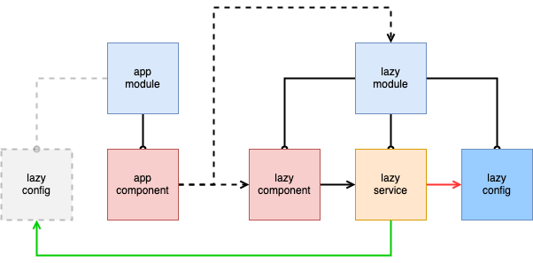

# Injector lazy load component problem

Sample code to reproduce an issue lazy loading modules with services with the provide in set to root.

This project was generated with [Angular CLI](https://github.com/angular/angular-cli) version 11.2.14.

## Architecture

The "lazy" module is lazy loaded in the main app component.
The lazy module has a service that needs some configuration in order to work, the service expects the configuration to be listed in the providers in the module.
That service also has the Injectable decorator with the attribute providedIn set to root.



## Issue

If you run the application you get the following error:

```
NullInjectorError: No provider for LazyConfig!
```

If we move the configuration from the lazy module to the app module the code works.
It would be nice to not include those configs in the app module before the lazy module is loaded to not defeat the purpose of lazy loading that module.

## Development server

Run `ng serve` for a dev server. Navigate to `http://localhost:4200/`. The app will automatically reload if you change any of the source files.
